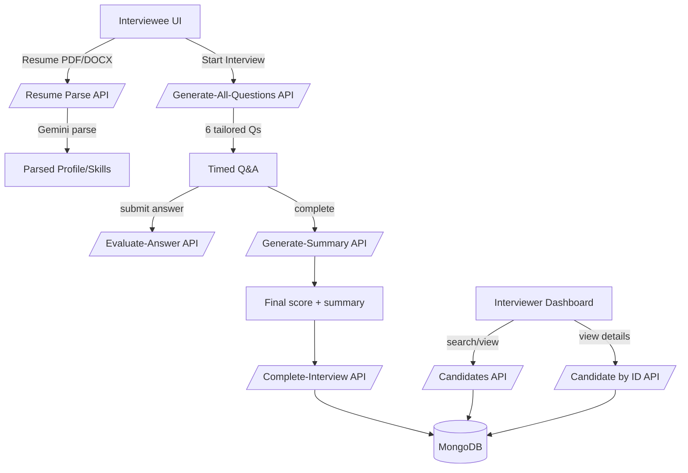

# CRISP Interview Assistant

An AI-powered technical interview assistant built on Next.js App Router that streamlines candidate screening with resume parsing, personalized question generation, timed sessions, AI evaluation, and an interviewer dashboard.

## Features

- **Interviewee experience**: Resume upload (PDF/DOC/DOCX), AI-powered parsing, role/topic selection, timed Q&A, autosave/recovery
- **Question generation**: Generates all questions up-front for a smooth timer experience
- **AI integration (Gemini)**: Resume parsing, question generation, answer evaluation, performance summary
- **Dashboard**: Searchable candidate list, ranking, details page with transcript and scores
- **Persistence**: IndexedDB for in-progress sessions; MongoDB for completed interviews

## Tech Stack

- **Framework**: Next.js 15 (App Router), React 19
- **State**: Redux Toolkit + redux-persist (IndexedDB via localforage)
- **UI**: Tailwind CSS 4, shadcn-style primitives, Radix UI, lucide-react
- **AI**: `@google/generative-ai` (Gemini), LangChain primitives in `lib/ai/chain.ts`
- **DB**: MongoDB (official Node driver)
- **Parsing**: `mammoth` for DOC/DOCX, Gemini for PDF/DOCX understanding
- **Types/Schemas**: TypeScript + Zod

## Getting Started

### Prerequisites

- Node.js 18+ (recommended 20+)
- A MongoDB database (Atlas or local)
- Optional: Google Gemini API key for full AI features

### Installation

```bash
bun install  # or pnpm install / npm install
```

### Environment Variables

Create `.env.local` in the project root:

```ini
# Google Gemini (recommended for production)
GEMINI_API_KEY=your_key_here
# or
GOOGLE_API_KEY=your_key_here

# Optional model override (defaults to gemini-2.5-flash)
CRISP_GEMINI_MODEL=gemini-2.5-pro

# MongoDB connection
MONGODB_URI=mongodb+srv://<user>:<pass>@<cluster>/<db>?retryWrites=true&w=majority
MONGODB_DB=crisp
```

Behavior without a Gemini key:

- Real endpoints continue to work with a deterministic mock question bank, heuristic scoring, and fallback summaries.

### Scripts

```bash
bun dev         # run the Next.js dev server
bun run build   # production build
bun start       # start production server
bun lint        # run eslint
```

### Run the App

```bash
bun dev
# open http://localhost:3000
```

## Architecture Overview

| Layer              | Responsibilities                                                             |
| ------------------ | ---------------------------------------------------------------------------- |
| Frontend (Next.js) | Upload UI, timers, local state & recovery, interviewer dashboard             |
| API Routes         | LLM orchestration, evaluation, summary generation, MongoDB persistence       |
| Local (IndexedDB)  | In-progress interview state (questions, answers, timers, profile)            |
| MongoDB            | Completed interviews (profile + Q&A + per-question + final summary + scores) |



## User Workflow

1. Upload resume (PDF/DOC/DOCX) → AI parses candidate details for autofill
2. Choose role/topic → app generates 6 questions up-front
3. Timed interview: 2 Easy → 2 Medium → 2 Hard with autosave
4. Each answer is scored by AI, then a final summary is produced
5. On completion, the interview is stored in MongoDB and appears in the dashboard

## UI Pages

- `app/page.tsx`: Landing and navigation
- `app/interviewee/page.tsx`: Interviewee experience (upload, profile, Q&A, timers)
- `app/interviewer/page.tsx`: Dashboard list/search/sort of completed interviews
- `app/interviewer/[id]/page.tsx`: Candidate details with transcript, per-question scores, summary
- `app/workflow/page.tsx`: Visual workflow/diagram

## API Reference

All routes use POST unless noted and return JSON.

### Resume

- `POST /api/resume/parse`
  - Content-Type: `multipart/form-data` with `file`
  - Response: `{ success: true, resume: { name?, email?, phone?, skills?, experience?, education?, summary?, linkedIn?, github?, extractionMethod } }`

### Interview

- `POST /api/interview/generate-question`

  - Body: `{ index: number, difficulty: 'easy'|'medium'|'hard', role: string, topic?: string, resumeData?: object }`
  - Response: `{ question: string, source: 'llm'|'mock'|'fallback', error? }`

- `POST /api/interview/generate-all-questions`

  - Body: `{ questions: Array<{ id: string, index: number, difficulty: 'easy'|'medium'|'hard' }>, role: string, topic?: string, resumeData?: object }`
  - Response: `{ success: boolean, questions: Array<{ id: string, index: number, question?: string, source?: string, error?: string }> }`

- `POST /api/interview/evaluate-answer`

  - Body: `{ question: string, answer: string }`
  - Response: `{ score: 0..5, feedback: string }` (includes `source: 'fallback'` if Gemini failed)

- `POST /api/interview/generate-summary`

  - Body: `{ questions: InterviewQuestion[] }` where `InterviewQuestion` includes `index, difficulty, answer?, score?`
  - Response: `{ finalScore: number, summary: string, source: 'llm'|'heuristic'|'fallback', error? }`

- `POST /api/interview/complete-interview`
  - Body: `CompletedInterview` (validated via Zod)
  - Response: `{ ok: true }`

### Candidates

- `GET /api/candidates/get-all?q=<text>&sort=<score|-score|created|-created>`

  - Response: `{ candidates: Array<{ _id, sessionId, profile:{name,email}, finalScore, summary, createdAt }> }`

- `GET /api/candidates/:id`
  - `:id` can be `sessionId` or MongoDB `_id`
  - Response: `{ interview }` or 404

## Data Models

`CompletedInterview` (stored in MongoDB):

```ts
type CompletedInterview = {
	sessionId: string;
	role: string;
	profile: {
		name?: string;
		email?: string;
		phone?: string;
		resumeExtracted?: boolean;
	};
	questions: Array<{
		id: string;
		index: number;
		difficulty: "easy" | "medium" | "hard";
		question: string;
		answer?: string;
		score?: number;
		allottedMs: number;
		startedAt?: number;
		submittedAt?: number;
	}>;
	finalScore: number; // 0-100
	summary: string;
	createdAt: number; // epoch ms
	completedAt: number; // epoch ms
	version: 1;
};
```

## Development Notes

- AI provider logic lives in `lib/ai/provider.ts`. Without an API key, it falls back to mocks/heuristics.
- LangChain helpers in `lib/ai/chain.ts` are used behind the provider; prompts are concise and retried with backoff.
- MongoDB helper in `lib/db/mongodb.ts` exposes `getDb()` and requires `MONGODB_URI`/`MONGODB_DB`.

## Deployment

- Works well on Vercel. Set required env vars in the project settings.
- Ensure your MongoDB IP allowlist permits Vercel egress or use Atlas with peering/SRV.
- For local production run:

```bash
bun build && bun start
```

## Troubleshooting

- **Missing Gemini key**: AI falls back to mock questions and heuristic scoring. Set `GEMINI_API_KEY` (or `GOOGLE_API_KEY`).
- **MongoDB connection errors**: Verify `MONGODB_URI` and `MONGODB_DB`; check network allowlist and SRV correctness.
- **PDF/DOCX parse issues**: If DOCX parsing misbehaves, the server extracts raw text via `mammoth` and sends that to Gemini. Validate the file type and size.
- **429/5xx from Gemini**: Provider includes simple retries with exponential backoff; transient errors will auto-retry.
- **Type validation failures**: `complete-interview` validates payloads via Zod—inspect `issues` in the 400 response.

## Acknowledgements

- Google Gemini via `@google/generative-ai`
- LangChain / LangGraph primitives
- Radix UI, shadcn-style components, lucide-react
- MongoDB Node driver

## License

This project is released under the MIT License. See `LICENSE` for details.
